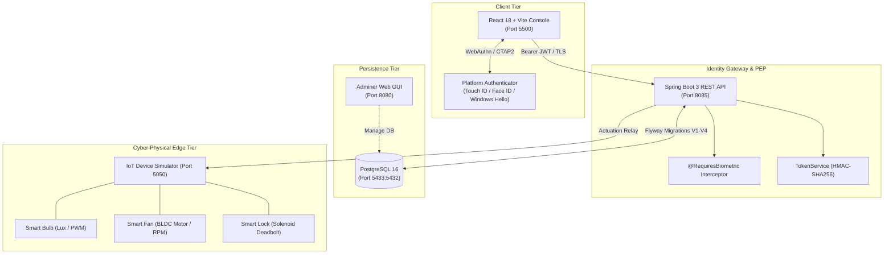

# ANTAR Auth — WebAuthn Biometric Auth, RBAC & Cyber-Physical Actuation

Standalone zero-trust authentication and cyber-physical actuation microservice framework. Built for edge computing and IoT environments to test fingerprint/Face ID/Windows Hello (**FIDO2/WebAuthn**) login, fine-grained role-based access control (**RBAC/ABAC**), and mandatory **biometric step-up verification** for safety-critical actions before integrating into the wider ANTAR stack.

---

## What's in This Project

- **`auth-service` (Port 8085):** Spring Boot 3 / Java 21 identity gateway, FIDO2 Relying Party (RP), and Policy Enforcement Point (PEP).
- **`auth-db` (Port 5433 host / 5432 internal):** PostgreSQL 16 storing user credentials, monotonic signature counters, dynamic policies, and service permissions (managed via Flyway migrations `V1`–`V4`).
- **`frontend` (Port 5500):** Modern React 18 + Vite single-page dashboard for passkey registration, biometric login, user management, and live IoT device control.
- **`iot-simulator` (Port 5050):** Python 3 cyber-physical hardware emulator with real-time telemetry and closed-loop feedback for smart devices.
- **`db-admin` (Port 8080):** Adminer web GUI for database inspection and direct state management.

---

## Stateless vs. Stateful Authentication Division

A core architectural challenge in distributed edge and IoT systems is session design: *Should authentication be stateless (for speed and horizontal scaling) or stateful (for instant revocation and tamper-proof auditing)?* 

ANTAR-Auth solves this by implementing a **hybrid division of labor**: edge request evaluation is completely **stateless**, while cryptographic identity verification and hardware clone detection remain strictly **stateful**.

```
┌──────────────────────────────────────────────────────────────────────────────────┐
│                        ANTAR AUTH DUAL ARCHITECTURE                              │
│                                                                                  │
│   STATELESS PLANE (Edge Scalability)          STATEFUL PLANE (Security Anchor)   │
│   • 4-Hour Session JWT (T_session)           • Hardware Monotonic Counters (c)   │
│   • 60-Second Ephemeral Step-Up (T_stepup)   • Anti-Clone Detection (Postgres)   │
│   • In-Memory AOP (@RequiresBiometric)       • 120s CSPRNG Replay Nonces         │
│   • Zero DB hits for downstream services     • Persistent ABAC/RBAC Matrix       │
│   • High-throughput API gateway relay        • Immediate credential revocation   │
└──────────────────────────────────────────────────────────────────────────────────┘
```

### 1. What is Stateless in This Project?
- **Self-Contained Session Tokens ($T_{\text{session}}$):** Upon successful login, the gateway signs an HMAC-SHA256 JWT containing `sub` (User ID), `username`, `role` (`ADMIN`, `USER`, `GUEST`), and a 4-hour expiration. Downstream microservices (e.g. `streaming-svc`, `nas-orchestrator`) can validate incoming Bearer tokens locally in CPU memory without hitting a centralized database or Redis session store.
- **Ephemeral Step-Up Tokens ($T_{\text{stepup}}$):** Minted exclusively after completing a fresh biometric prompt for high-risk operations. The token is cryptographically bound to the target action and resource (e.g. `action="UNLOCK"`, `resourceId="smart-lock"`) and has an ultra-short **60-second TTL**.
- **AOP Security Interception (`@RequiresBiometric`):** Controllers declare sensitive endpoints with `@RequiresBiometric(action = "...")`. The Spring AOP interceptor validates the incoming `X-Step-Up-Assertion` header entirely in-memory: verifying signature, TTL, and action binding.
- **Stateless Spring Security:** Configured with `SessionCreationPolicy.STATELESS`—no HTTP sessions, cookies, or `JSESSIONID` exist on the server.

### 2. What is Stateful in This Project?
- **Hardware Monotonic Counter Clone Detection:** Every FIDO2 authenticator maintains an internal monotonic counter incremented on every physical touch. PostgreSQL records the highest verified count in `credentials.signature_count` ($c_{\text{db}}$). On every assertion, the server validates:
  $$c_{\text{rx}} > c_{\text{db}}$$
  If a cloned authenticator or replay attempt sends $c_{\text{rx}} \le c_{\text{db}}$, the gateway instantly rejects the request and permanently revokes the credential in the database.
- **CSPRNG Challenge-Response Windows:** FIDO2 ceremonies require server-generated 256-bit cryptographic nonces with a 120-second lifespan to prevent man-in-the-middle replay attacks.
- **Persistent Access Policies & Identity Matrix:** PostgreSQL persists user accounts, BCrypt password fallbacks, service registries (`microservices`), explicit user permissions (`service_permissions`), preset auth requirements (`access_policies`), and resource ownership (`resource_ownership`).
- **Physical Hardware State:** The IoT simulator maintains continuous hardware registers for appliance power, fan speeds, motor RPM, and deadbolt solenoid positions.

### Comparison Summary

| Attribute | Stateless Layer (JWTs & AOP) | Stateful Layer (Database & TPM) |
| :--- | :--- | :--- |
| **Where it lives** | Client memory / Authorization headers | PostgreSQL 16 & Authenticator Silicon |
| **Verification speed** | $\approx 0.1\text{ ms}$ (CPU HMAC verification) | $\approx 2\text{--}5\text{ ms}$ (Database query) |
| **Scaling capability** | Unlimited horizontal microservice scaling | Centralized identity authority |
| **Revocation method** | Natural token expiry (4 hours / 60 seconds) | Instant administrative revocation in DB |
| **Primary purpose** | High-throughput, low-latency edge routing | Anti-cloning, anti-replay, and access control |

---

## System Architecture



---

## Edge IoT Actuators & Telemetry Dynamics

The Python hardware emulator (`devices/simulator.py`) simulates realistic cyber-physical devices with closed-loop feedback:

1. **Photometric Lighting Node (`smart-bulb`):** Simulates ambient lux tracking across diurnal cycles ($L_{\text{ambient}}(t) = 475 + 260\sin(\omega t) + \xi(t)$), an optical slew-rate limiter ($\le 2\%$ brightness shift per tick), and dynamic power consumption ($2.0\text{W} - 10.0\text{W}$).
2. **Climate Ventilation Node (`smart-fan`):** 5-speed BLDC motor rotor with tachometer feedback ($400\text{--}2000\text{ RPM}$) and continuous $90^\circ$ bidirectional oscillation.
3. **Perimeter Security Barrier (`smart-lock`):** High-security motorized deadbolt governed by a 12V solenoid motor with battery voltage monitoring. Transitions from $\text{ARMED} \to \text{UNLOCKED}$ strictly upon valid biometric step-up.

---

## Prerequisites & Setup

- **Docker & Docker Compose**
- A browser with WebAuthn support (Chrome, Safari, Edge) on a device with biometrics (Touch ID, Face ID, Windows Hello, or Android biometrics).
- **Important:** WebAuthn only functions over `localhost` or HTTPS. Do not access via a local IP (e.g. `192.168.x.x`) without TLS.

### 1. Environment Configuration

```bash
cp .env.example .env
```

Ensure your `.env` contains:
```env
DB_PASSWORD=my_secure_db_pass_2026
JWT_SIGNING_SECRET=generate_with_openssl_rand_base64_48
WEBAUTHN_RP_ID=localhost
WEBAUTHN_RP_NAME=ANTAR Auth (PoC)
WEBAUTHN_ORIGIN=http://localhost:5500
```

### 2. Launch Stack

```bash
docker compose up --build
```

Access the services:
- **Web Console:** `http://localhost:5500`
- **Identity API:** `http://localhost:8085`
- **IoT Simulator API & Logs:** `http://localhost:5050`
- **Database GUI (Adminer):** `http://localhost:8080` (System: PostgreSQL, Server: `auth-db`, User: `antar_auth`, DB: `authdb`)

---

## Test Sequences

### 1. Primary Biometric Registration & Login
1. Open `http://localhost:5500`. On the setup screen, click **"Register Passkey"**.
2. Your browser prompts for fingerprint/Face ID/Windows Hello. This links your hardware key to the seeded `admin` account.
3. Click **"Login with Biometrics"** and touch your sensor again. You receive an active `SESSION` JWT (`role: ADMIN`).

### 2. Routine Control vs. Biometric Step-Up
1. **Routine Control:** On the **Elements** tab, toggle the **Smart Bulb** or change the **Smart Fan** speed. The action executes immediately using your ambient session token.
2. **Step-Up Enforcement:** Click **"Unlock Deadbolt"** on the **Smart Lock**.
3. Because the policy requires `BIOMETRIC_STEP_UP`, the gateway returns `403 STEP_UP_REQUIRED`.
4. The frontend automatically initiates a second biometric prompt.
5. Touch your sensor: the gateway issues a 60-second $T_{\text{stepup}}$ assertion token, retries the call with `X-Step-Up-Assertion`, and the deadbolt unlocks.

### 3. Password Fallback & First-Time Setup
If biometric authenticators are not present or fail:
1. Users can authenticate using a secondary BCrypt password via `POST /auth/password/login`.
2. Initial accounts created by an admin are flagged with `mustChangePassword=true`, prompting a required password update via `POST /auth/password/change` before standard operations proceed.

### 4. Testing RBAC with a Non-Admin User
1. Under the **Users** tab, register a new user (e.g. `alice` with role `USER`).
2. Log in as `alice`.
3. Routine controls work if granted, but administrative endpoints (such as modifying access policies) return `403 Access Denied`.
4. To grant `alice` permission to control a specific device, the admin can call:
   ```http
   POST /api/services/permissions/grant?username=alice&serviceKey=smart-fan&permissionLevel=CONTROL
   Authorization: Bearer <admin session JWT>
   ```

### 5. File Ownership & Biometric Deletion Sandbox
The system includes a sandbox for file-level access control under `/files`:
- **General File Access:** `GET /files/access-check?resourceId=movie-001&action=STREAM` $\to$ `200 GRANTED_GENERAL` (general content accessible by any `USER`).
- **Private File Access:** `GET /files/access-check?resourceId=alice-private-video&action=STREAM` $\to$ `200 GRANTED_OWN_PRIVATE` (accessible only by owner).
- **Destructive Deletion:** `DELETE /files/delete?resourceId=alice-private-video`:
  - Calling without the step-up header returns `403 STEP_UP_REQUIRED` (deletion is always safety-critical).
  - Calling with `X-Step-Up-Assertion` after a fresh biometric prompt returns `200 File deleted (step-up verified)`.

---

## Default Access Policy Matrix

Configured in `access_policies` (seeded in Flyway migration `V4`):

| Service Key | Action ($\alpha$) | Role ($r$) | Auth Requirement | Enforcement Details |
| :--- | :--- | :--- | :--- | :--- |
| `smart-bulb` | `POWER` | `USER` | `NO_AUTH` | Open edge access / ambient light switch |
| `smart-bulb` | `POWER` | `GUEST` | `SESSION` | Must hold an active guest session token |
| `smart-fan` | `SPEED` | `USER` | `SESSION` | Routine control via session token |
| `smart-fan` | `SPEED` | `GUEST` | `SESSION` | Requires session + explicit service grant |
| `smart-lock` | `UNLOCK` | `USER` | **`BIOMETRIC_STEP_UP`** | Hardware biometric touch mandatory |
| `smart-lock` | `UNLOCK` | `ADMIN` | **`BIOMETRIC_STEP_UP`** | Hardware biometric touch mandatory |
| `nas-storage` | `DELETE` | `USER` | **`BIOMETRIC_STEP_UP`** | Destructive deletion requires step-up |
| `nas-storage` | `DELETE` | `ADMIN` | **`BIOMETRIC_STEP_UP`** | Destructive deletion requires step-up |

---

## API Summary

| Category | Method | Endpoint | Auth | Description |
| :--- | :--- | :--- | :--- | :--- |
| **WebAuthn** | `POST` | `/webauthn/register/start?username={u}` | None | Generates enrollment options & challenge |
| | `POST` | `/webauthn/register/finish?username={u}` | None | Verifies attestation; stores COSE public key |
| | `POST` | `/webauthn/login/start?username={u}` | None | Generates assertion challenge |
| | `POST` | `/webauthn/login/finish?username={u}` | None | Validates assertion & counter; returns $T_{\text{session}}$ |
| | `POST` | `/webauthn/stepup/start?username={u}` | Bearer | Initiates biometric challenge for sensitive action |
| | `POST` | `/webauthn/stepup/finish?username={u}&action={a}&resourceId={r}` | Bearer | Issues 60s action-bound $T_{\text{stepup}}$ |
| **Password** | `POST` | `/auth/password/login` | None | Fallback login if biometrics are unavailable |
| | `POST` | `/auth/password/set` | Bearer (Admin) | Sets or resets secondary password |
| | `POST` | `/auth/password/change` | Bearer | Updates initial or temporary password |
| **Users** | `GET` | `/api/users` | Bearer (Admin) | Lists users, roles, and credential status |
| | `POST` | `/api/users` | Bearer (Admin) | Creates user with default password |
| | `DELETE`| `/api/users/{username}` | Bearer (Admin) | Cascading delete of user and credentials |
| **Services** | `GET` | `/api/services` | Bearer | Microservices catalog |
| | `POST` | `/api/services/permissions/grant` | Bearer (Admin) | Grants explicit service permissions |
| | `GET` | `/api/services/policies` | Bearer | Lists active access policy presets |
| | `POST` | `/api/services/policies` | Bearer (Admin) | Updates policy requirement level |
| | `POST` | `/api/services/device-control` | Bearer / Step-Up | Relays control action to IoT devices |
| **Files** | `GET` | `/files/access-check` | Bearer | Validates resource streaming permission |
| | `DELETE`| `/files/delete` | Step-Up Header | Biometric-gated file deletion |
| **Simulator**| `GET` | `http://localhost:5050/api/devices` | None | Live telemetry from IoT simulator |
| | `POST` | `http://localhost:5050/api/devices/{id}/control` | None | Direct device actuation endpoint |
| | `GET` | `http://localhost:5050/api/events` | None | Live event log buffer of physical actions |

---

## Security Invariants

1. **Hardware Non-Repudiation:** Cryptographic assertions are generated strictly within platform authenticators upon local biometric verification ($UV=1$).
2. **Replay Defense:** Assertion nonces are cryptographically random, single-use, and valid for at most 120 seconds.
3. **Authenticator Clone Detection:** Enforces strictly increasing monotonic hardware signature counters ($c_{i+1} > c_i$). Cloned authenticators trigger instant credential invalidation.
4. **Blast-Radius Containment:** Ephemeral assertion tokens ($T_{\text{stepup}}$) are restricted to a single $(\alpha, \rho)$ action-resource pair and expire after 60 seconds.
